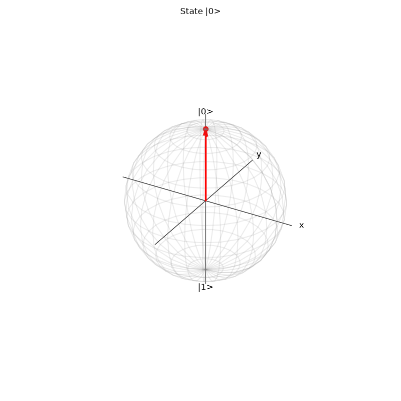
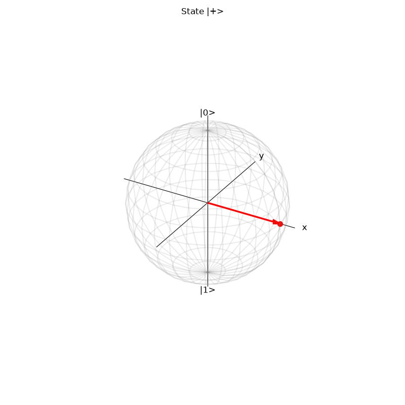
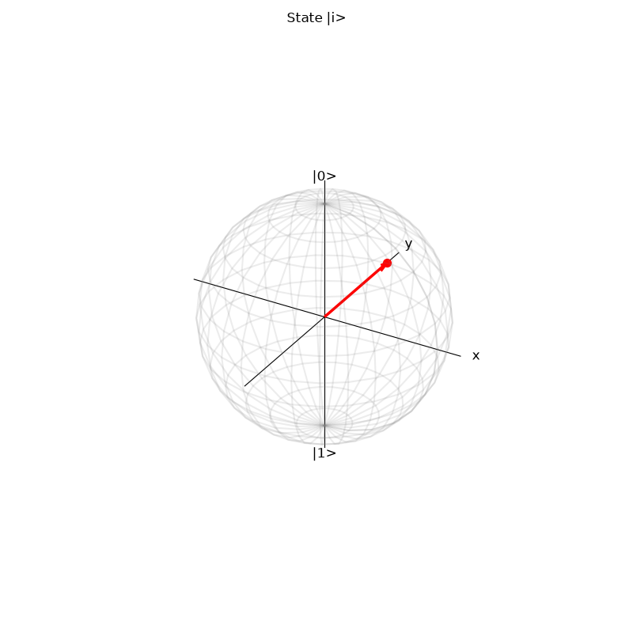

# Bloch Sphere Visualizer

A lightweight tool to calculate and visualize the geometric representation of a single qubit on the Bloch sphere, using only NumPy and Matplotlib.

This project maps the abstract complex statevector of a qubit $[\alpha, \beta]$ into physical $3D$ space. It explicitly handles the removal of global phase and computes the spherical coordinates ($\theta$ and $\phi$) required for plotting.

## What it does

1. Takes a complex $2D$ NumPy array representing a qubit state.
2. Mathematically isolates the relative phase by adjusting the global phase.
3. Computes the $\theta$ (latitude) and $\phi$ (longitude) angles.
4. Converts these angles to Cartesian coordinates ($x, y, z$).
5. Renders a $3D$ wireframe sphere and plots the state vector using Matplotlib.





## Requirements

- Python 3.x
- NumPy (`pip install numpy`)
- Matplotlib (`pip install matplotlib`)

## Usage

Run the visualizer directly from the command line:

```bash
python bloch_visualizer.py
```
