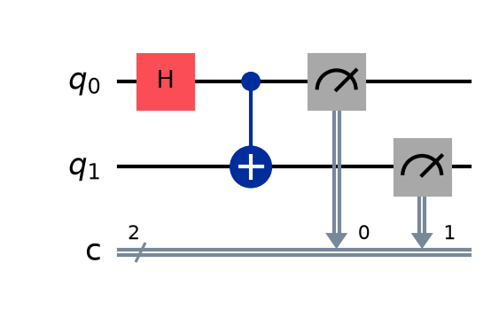
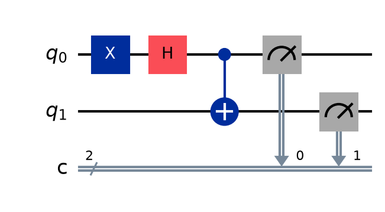
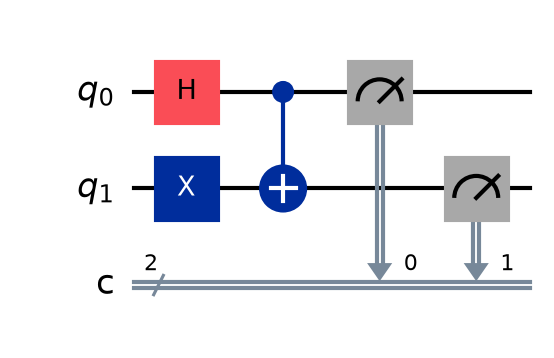
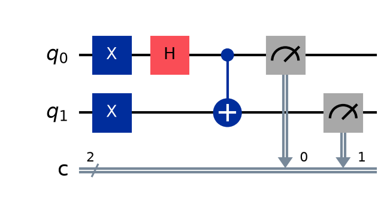

## Bell States Explorer

### 1. The Core Concept: What are we building?

In classical computing, bits are independent. In quantum computing, we can link qubits together so that the state of one instantly dictates the state of the other, regardless of distance. This is **entanglement**. The four simplest and universally used maximally entangled states are called the **Bell States** (or EPR pairs).

### 2. The Mechanics: How the Circuit Works

To create a Bell state, we always use the same two-gate architecture:

1.  **Hadamard Gate (H):** Applied to the first qubit ($q_0$). It puts the qubit into a perfect superposition (a 50/50 probability of being 0 or 1).
2.  **Controlled-NOT Gate (CX):** Uses the first qubit ($q_0$) as a control and the second ($q_1$) as the target. If the first qubit is 1, it flips the second qubit.

Because the first qubit is in a superposition when the CX gate triggers, the second qubit enters a superposition that is mathematically locked to the first.

### 3. The Four States

The notebook initializes circuits for all four possible classical starting states ($|00\rangle$, $|10\rangle$, $|01\rangle$, $|11\rangle$) to generate the four distinct Bell states.

Here is the breakdown of each state implemented in the code:

#### $\Phi^+$ (Phi Plus)

- **Initial State:** $|00\rangle$
- **Math:** $\frac{1}{\sqrt{2}}(|00\rangle + |11\rangle)$
- **Result:** The qubits perfectly agree. When measured, you will get `00` ~50% of the time and `11` ~50% of the time.

  

#### $\Phi^-$ (Phi Minus)

- **Initial State:** $|10\rangle$ _(Achieved by applying an X gate to $q_0$ before the Hadamard)_
- **Math:** $\frac{1}{\sqrt{2}}(|00\rangle - |11\rangle)$
- **Result:** They still perfectly agree (`00` or `11`), but with an opposite relative phase. (Phase doesn't alter the probability distribution in a standard z-basis measurement, but is crucial for interference in advanced algorithms).

  

#### $\Psi^+$ (Psi Plus)

- **Initial State:** $|01\rangle$ _(Achieved by applying an X gate to $q_1$ before the CX)_
- **Math:** $\frac{1}{\sqrt{2}}(|01\rangle + |10\rangle)$
- **Result:** The qubits perfectly disagree. If one is 0, the other is _always_ 1. You will measure `01` ~50% of the time and `10` ~50% of the time.

  

#### $\Psi^-$ (Psi Minus)

- **Initial State:** $|11\rangle$ _(Achieved by applying an X gate to both $q_0$ and $q_1$)_
- **Math:** $\frac{1}{\sqrt{2}}(|01\rangle - |10\rangle)$
- **Result:** They perfectly disagree (`01` or `10`), again with an inverted relative phase.

  

## Requirements

`pip install numpy matplotlib qiskit qiskit-aer pylatexenc `
